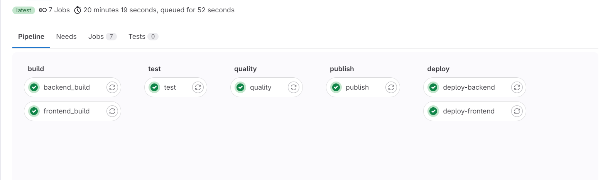

# ElderLink: A Community-Focused Platform

ElderLink is a community-focused platform designed to bridge the gap between elders in need of assistance and willing volunteers, integrating a credit-based reward system. Initially, elders are allocated credits which serve as a token of appreciation for the volunteers' time and efforts. Upon successfully receiving help, elders transfer credits to volunteers, commensurate with the hours of assistance provided. Elders can easily request help through a simple form, and these requests become visible to a network of volunteers. When a volunteer accepts a request, the elder is notified and given the volunteer's details, offering the elder the option to select the volunteer they feel most comfortable with. This system not only ensures that elders receive the personalized support they need but also incentivizes volunteers by recognizing their valuable contributions, thereby fostering a supportive, engaged, and rewarding community ecosystem.

## Table of Contents

- [Introduction](#introduction)
- [Technologies Used](#technologies-used)
- [Getting Started](#getting-started)
  - [Prerequisites](#prerequisites)
  - [Installation](#installation)
    - [Frontend Setup](#frontend-setup)
    - [Backend Setup](#backend-setup)
- [Usage Scenario](scenarios.md)
  - [Features](scenarios.md#features)
    - [For Elder Persons](scenarios.md#for-elder-persons)
    - [For Volunteers](scenarios.md#for-volunteers)
- [Website Navigation](scenarios.md#website-navigation)
  - [Registration Page](scenarios.md#registration-page)
  - [Login Page](scenarios.md#login-page)
  - [Post Help](scenarios.md#post-help)
  - [About Us](scenarios.md#about-us)
  - [Blogs](scenarios.md#blogs)
  - [User Profile](scenarios.md#user-profile)
  - [Request from Elders](scenarios.md#request-from-elders)
  - [Interested Volunteers](scenarios.md#interested-volunteers)
  - [Credit Transfer](scenarios.md#credit-transfer)
- [GitLab CI/CD Pipeline Configuration](deployment.md#gitlab-cicd-workflow-overview)
- [Deployment on VM](deployment.md#Deployment-on-vm)
 - [Backend Deployment Steps](deployment.md#Backend-deployment-steps)
 - [Frontend Deployment Steps](deployment.md#frontend-deployment-steps)


## Introduction

ElderLink aims to bridge the gap between elderly individuals seeking assistance for daily tasks and volunteers eager to contribute their time and skills. Through a credit-based system, it encourages community participation and ensures that help is always at hand.

## Technologies Used

[](https://spring.io/projects/spring-boot)
[](https://reactjs.org/)
[](https://tailwindcss.com/)
[](https://www.mysql.com/)
[](https://img.shields.io/badge/GitLab-v14.0-blue)


## Getting Started

### Prerequisites

- [ReactJS](https://reactjs.org/) `v20.x`
- [npm](https://www.npmjs.com/) `v6.x`
- [TypeScript](https://www.typescriptlang.org/) `v4.x`
- [Java `v17.0.2`](https://www.oracle.com/java/)`v17.0.2`
- [JDK `v17`](https://www.oracle.com/java/)`v17`
- [Maven `v3.9.6`](https://maven.apache.org/)`v3.9.6`
- [Vite `v5.0.12`](https://vitejs.dev/)`v5.0.12`

### Installation

## Frontend Setup

### 1. Clone the Repository

```bash
git clone https://git.cs.dal.ca/courses/2024-winter/csci5308/Group12.git
```

### 2. Navigate to the Project Directory

```bash
cd Group12/frontend
```

### 3. Install Dependencies

Before proceeding, ensure you have Node.js and npm installed on your system.

To install frontend dependencies, execute the following command:

```bash
npm install
```

### 4. Start Development

Once dependencies are installed, initiate the React development server by executing:

```bash
npm run dev
```

This will launch the development environment.

### Accessing the Website

Open your preferred web browser and navigate to [http://localhost:5173](http://localhost:5173) to access the website.
## Frontend Dependencies

| Dependency                             | Description                                       | Version    |
|----------------------------------------|---------------------------------------------------|------------|
| @radix-ui/react-slot                   | Utility for creating slotted components           | ^1.0.2     |
| axios                                  | Promise based HTTP client for the browser and Node.js | ^1.6.7    |
| class-variance-authority               | Utility for class variance management            | ^0.7.0     |
| clsx                                   | Utility for conditional CSS classes              | ^2.1.0     |
| lucide-react                           | Icon set for React                               | ^0.322.0   |
| react                                  | JavaScript library for building user interfaces  | ^18.2.0    |
| react-dom                              | Entry point to the DOM and server renderers for React | ^18.2.0|
| react-icons                            | Icon set for React                               | ^5.0.1     |
| react-router-dom                       | DOM bindings for React Router                    | ^6.22.0    |
| react-toastify                         | Notification library for React                   | ^10.0.4    |
| tailwind-merge                         | Utility for merging Tailwind CSS classes         | ^2.2.1     |
| tailwindcss-animate                    | Utility for adding CSS animations with Tailwind CSS | ^1.0.7   |
| @types/node                            | TypeScript type definitions for Node.js           | ^20.11.16  |
| @types/react                           | TypeScript type definitions for React             | ^18.2.43   |
| @types/react-dom                       | TypeScript type definitions for React DOM         | ^18.2.17   |
| @typescript-eslint/eslint-plugin      | ESLint plugin for TypeScript                      | ^6.14.0    |
| @typescript-eslint/parser             | TypeScript parser for ESLint                      | ^6.14.0    |
| @vitejs/plugin-react                   | Vite plugin for React development                 | ^4.2.1     |
| autoprefixer                           | PostCSS plugin to parse CSS and add vendor prefixes| ^10.4.17   |
| eslint                                 | Linter tool for JavaScript and TypeScript files   | ^8.55.0    |
| eslint-plugin-react-hooks              | ESLint plugin for React Hooks                     | ^4.6.0     |
| eslint-plugin-react-refresh            | ESLint plugin for React Refresh                   | ^0.4.5     |
| postcss                                | Tool for transforming CSS with JavaScript plugins | ^8.4.33    |
| tailwindcss                            | Utility-first CSS framework for rapid UI development | ^3.4.1   |
| typescript                             | Programming language for building web applications | ^5.2.2     |
| vite                                   | Next-generation frontend tooling                   | ^5.0.8     |


# Backend Setup


### 1. Clone the Repository
```bash
 git clone git@git.cs.dal.ca:courses/2024-winter/csci5308/Group12.git 
 OR
 git clone https://git.cs.dal.ca/courses/2024-winter/csci5308/Group12.git
```

### 2. Navigate to the project directory
```bash
cd Group12/backend
```

### 3. Build the project
- Run the following command to install backend dependencies:
```bash
mvn clean install
```

### 5. Run the application
- After installing dependencies, start the Spring Boot backend server by running:
```bash
mvn spring-boot:run
```

The application will be accessible at `http://localhost:8080`.
## Backend Dependencies


| Dependency                                                | Description                                         | Version | Artifact                                           |
|-----------------------------------------------------------|-----------------------------------------------------|---------|----------------------------------------------------|
| org.springframework.boot:spring-boot-starter-data-jpa     | Starter for using Spring Data JPA                   |         | spring-boot-starter-data-jpa                      |
| org.springframework.boot:spring-boot-starter-security    | Starter for using Spring Security                   |         | spring-boot-starter-security                      |
| org.modelmapper:modelmapper                               | Model mapping library                               | 3.0.0   | modelmapper                                       |
| org.springframework.boot:spring-boot-starter-web         | Starter for building web, including RESTful, applications using Spring MVC |         | spring-boot-starter-web                           |
| com.mysql:mysql-connector-j                               | MySQL JDBC driver                                   |         | mysql-connector-j                                 |
| org.projectlombok:lombok                                   | Java library that automatically plugs into your editor and build tools, spicing up your java |         | lombok                                            |
| org.springframework.boot:spring-boot-starter-test         | Starter for testing Spring Boot applications with libraries including JUnit, Hamcrest, and Mockito |         | spring-boot-starter-test                          |
| org.springframework.security:spring-security-test         | Spring Security test support                        |         | spring-security-test                              |
| io.jsonwebtoken:jjwt-jackson                              | Java JWT: JSON Web Token for Java and Android      | 0.11.5  | jjwt-jackson                                      |
| org.springframework.boot:spring-boot-starter-validation   | Starter for using Java Bean Validation with Hibernate Validator |         | spring-boot-starter-validation                    |
| io.jsonwebtoken:jjwt-api                                   | Java JWT: JSON Web Token for Java and Android (API) | 0.11.5  | jjwt-api                                          |
| io.jsonwebtoken:jjwt-impl                                  | Java JWT: JSON Web Token for Java and Android (Impl) | 0.11.5  | jjwt-impl                                         |
| io.jsonwebtoken:jjwt-jackson                               | Java JWT: JSON Web Token for Java and Android (Jackson) | 0.11.5  | jjwt-jackson                                      |
| org.junit.jupiter:junit-jupiter-api                       | JUnit Jupiter API                                   | 5.10.2  | junit-jupiter-api                                 |
| org.mockito:mockito-junit-jupiter                         | Mockito test framework for JUnit Jupiter           | 3.6.0   | mockito-junit-jupiter                             |
| org.mockito:mockito-core                                   | Mockito Core                                       | 3.6.0   | mockito-core                                      |
| org.apache.hadoop:hadoop-client-runtime                   | Hadoop Client Runtime                               | 3.3.4   | hadoop-client-runtime                             |


  


# GitLab CI/CD Workflow Overview

GitLab CI/CD allows automating the testing, building, and deployment processes for Node.js projects using a `.gitlab-ci.yml` file in the repository root. Here's an example configuration:



This CI/CD flow automates the software development lifecycle for the "Elderlink" web application, comprising the following stages:

### Build Stage

#### Backend Build:
- Uses Maven to build the backend application.
- Artifacts are stored in the `backend/target` directory.

#### Frontend Build:
- Utilizes Node.js to build the frontend application.
- Build files are stored in the `frontend/build` directory.

### Test Stage

- Executes backend tests using Maven.

### Quality Stage

- Conducts quality analysis on the codebase using DesigniteJava to identify code smells.
- Results are stored as artifacts for further analysis.

### Publish Stage

- Publishes Docker images of both the backend and frontend applications to Docker Hub.
- Execution is triggered only when changes are made to the `develop` branch.

### Deployment Stage

#### Backend Deployment:
- Deploys the backend Docker container onto a remote server.
- Pulls the latest Docker image from the registry and runs it on the specified server.

#### Frontend Deployment:
- Deploys frontend build files to the server's `/var/www/html` directory, presumably for web server accessibility.

This workflow ensures efficient integration, testing, code quality analysis, publishing, and deployment of changes to the "Elderlink" application.


## Credits 

### Developer Team

| Name                                | Email              |
| ----------------------------------- | ------------------ |
| Abhishek Kapoor | ab210637@dal.ca |
| Khush Patel | kh472243@dal.ca |
| Vyansi Dineshbhai Diyora | vy744910@dal.ca |
| Piyush Rakeshbhai Joshi | py287300@dal.ca |
| Riddho Bhadra | rd588330@dal.ca |


### Client Team

| Name                             | Email           |
| -------------------------------- | --------------- |
| Yash Walia | yashwalia@dal.ca |
| Kaushal Vijay Sapara | ks807529@dal.ca |
| Yukta Rajkumar Gurnani | yk868576@dal.ca |
| Raj Kamlesh Patel | rj227488@dal.ca |
| Harsh Maisuri | hr786278@dal.ca |
