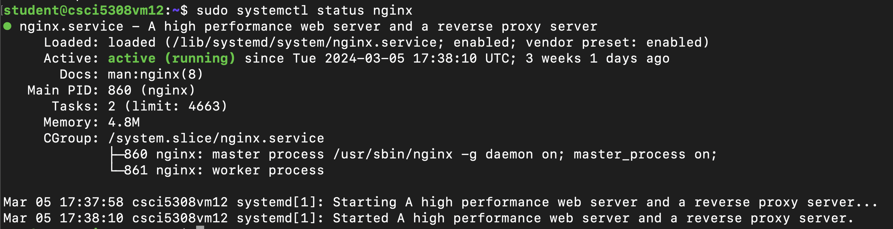

# Deployment Steps

## Overview

There are 3 core components of the application:
1. Backend in Spring Boot
2. Frontend in React
3. MySQL Database 

We have deployed our application on the virtual machine provided to us.
For backend we had used docker and for frontend we are using nginx as deployment server.

## Prerequisites

We need to have an environment with these requirements fulfilled:

- VM with Ubuntu OS

- [NGINX](https://www.nginx.com/) installed in VM

- [Docker](https://docs.docker.com/engine/install/) installed in VM 

- [Java SDK 17](https://www.oracle.com/ca-en/java/technologies/downloads/#java17) installed in VM. 
    - Note: check the version in prerequisites of development

- Check the values in [application.properties](./backend/src/main/resources/application.properties)

- Check the appropriate values in [.env](./frontend/.env)


---
# Deployment on VM

## Frontend Deployment Steps

### NGINX Configuration

1. **Install and Start NGINX:**

    ```bash
    sudo systemctl start nginx
    sudo systemctl status nginx
    ```

    Upon successful execution, NGINX starts running. The status should reflect the active state.

    

    *After starting NGINX, configuration adjustments are needed within the `/etc/nginx/sites-enabled` directory.*

    ```nginx
    server {
        listen 80 default_server;
        listen [::]:80 default_server;
        access_log /var/log/nginx/app.log;
        root /var/www/build;
        index index.html index.htm;
        try_files $uri /index.html;
        location / {
            try_files $uri index.html;
        }
    }
    ```

    *With these configurations, the NGINX setup is completed.*

### Deployment Steps

2. **Change Working Directory to Frontend:**

    ```bash
    cd frontend
    npm install
    npm i react-icons
    ```

3. **Run npm build Command:**

    ```bash
    npm run build
    ```

    *This command generates the build folder containing assets and other frontend components, including index.html.*

4. **Move Build Folder to VM's Directory:**

    *Copy the build folder to the NGINX serving directory `/var/www/html/` on the assigned VM.*

    ```bash
    scp -r -o StrictHostKeyChecking=no -i $ID_RSA frontend/build/* ${SERVER_USER}@${SERVER_IP}:/var/www/html/
    ```

    *Once the files are copied, NGINX will commence serving the index.html file on port 80 by default.*

These steps ensure a seamless deployment of the frontend application, leveraging NGINX for web serving.

---

# Backend Deployment Steps

Follow these steps to deploy the backend of your application:

1. **Navigate to Backend Directory:**

    Change your current directory to the backend folder where your project resides.

2. **Generate Jar File:**

    Run the following command to generate the JAR file in the target folder:

    ```bash
    ./mvnw clean package
    ```

3. **Build Docker Container:**

    Build the Docker container using the provided Dockerfile. You can utilize the latest image.

    ```bash
    docker build -t docker.io/[DOCKER_HUB_USERNAME]/elderlink-backend:latest .
    ```

4. **Push Docker Container:**

    Push the Docker container to your Docker Hub repository.

    ```bash
    docker push docker.io/[DOCKER_HUB_USERNAME]/elderlink-backend:latest
    ```

5. **Connect to Remote VM:**

    Establish an SSH connection to the remote VM where you intend to deploy the backend.


6. **Remove Existing Docker Container:**

    If there is a previous instance of the Docker container with the name "elderlink-backend," remove it using the following command:

    ```bash
    docker container rm -f elderlink-backend
    ```

7. **Run Docker Container on VM:**

    Start the Docker container on the VM by executing the following command:

    ```bash
    docker run -d -p 8080:8080 --name elderlink-backend docker.io/[DOCKER_HUB_USERNAME]/elderlink-backend:latest
    ```

8. **Access Application:**

    Upon successful execution of the above command, your application will be accessible at port 8080.

These steps ensure a smooth deployment of your backend application.


### **Conclusion:**
At this juncture, we are poised to access the frontend via the designated URL of the virtual machine (VM), thereby enabling seamless communication between the frontend and backend components.
