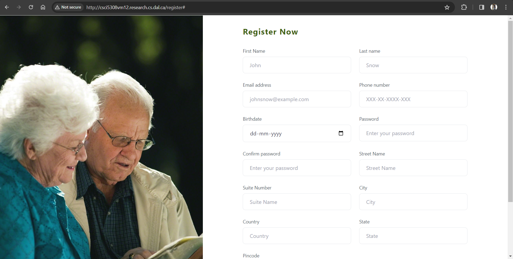
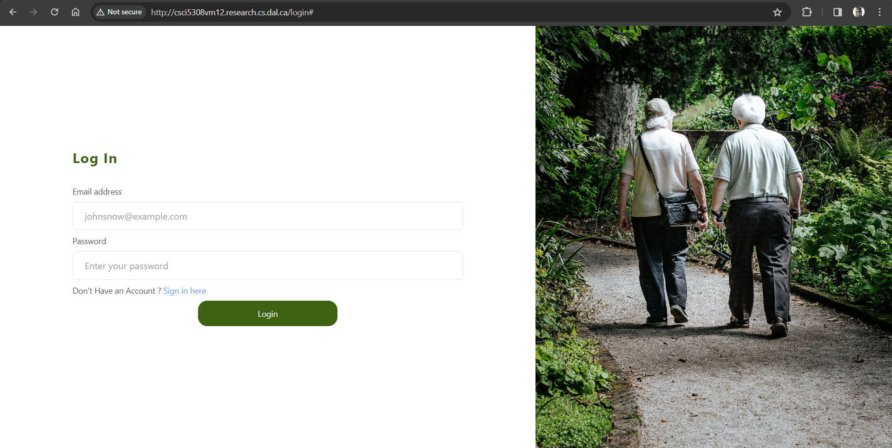
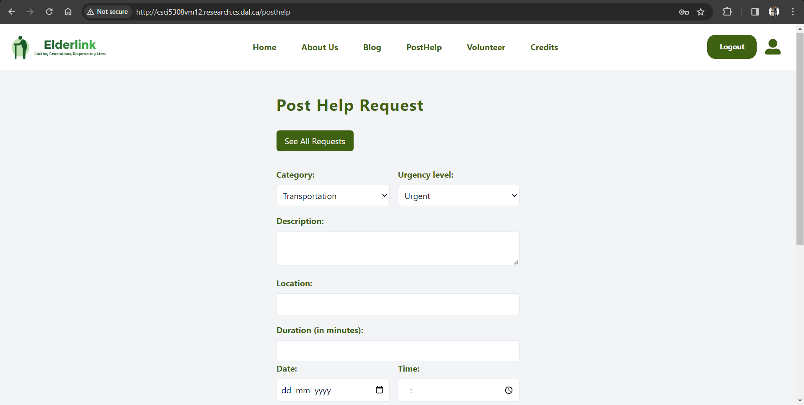
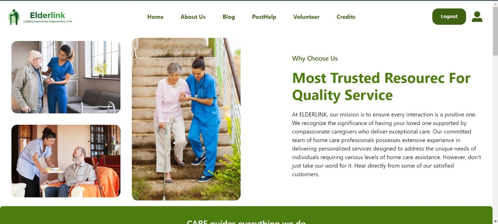
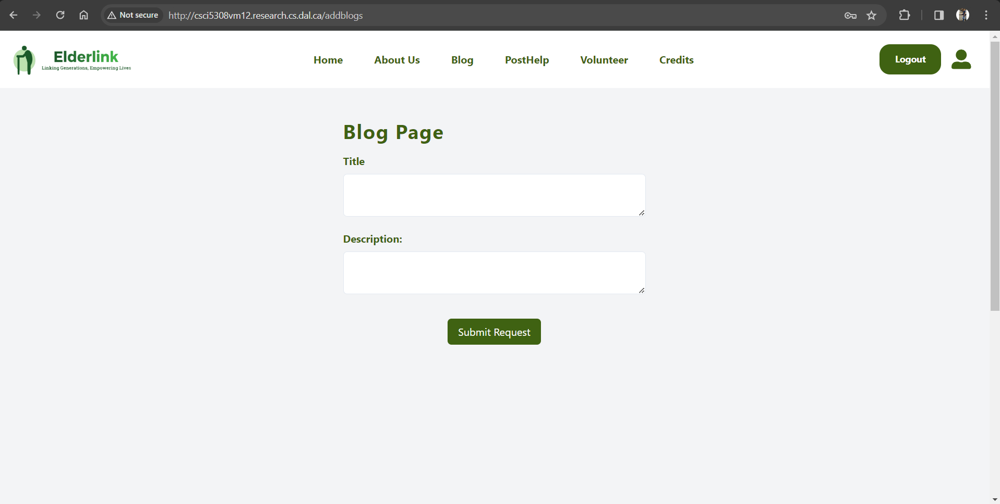
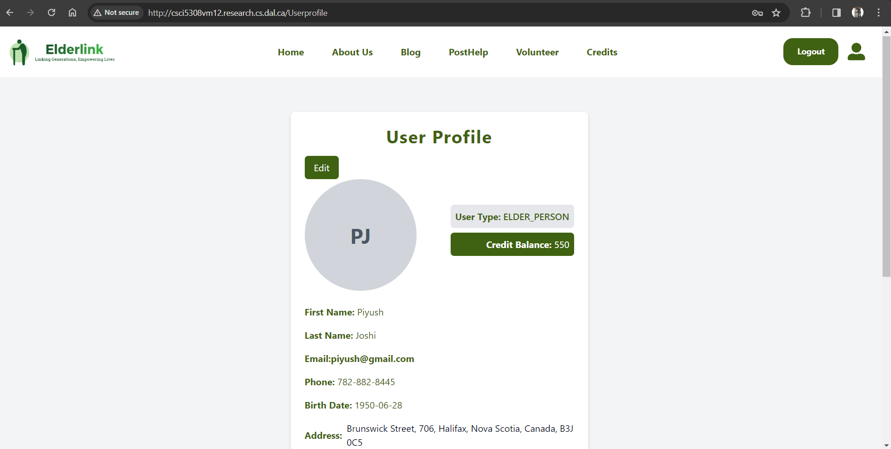
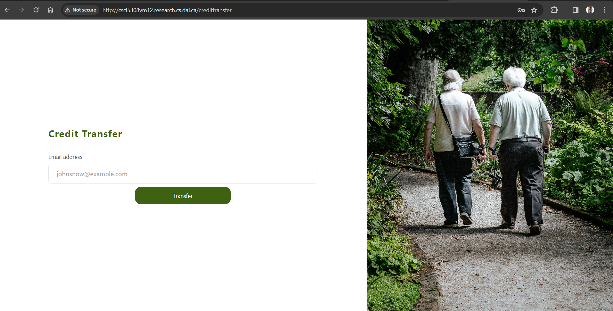

# Usage Scenario

## Features
### Register and Profile Setup

All users begin by registering on the platform with their basic information. After registration, completing the profile setup is crucial. This includes adding interests, availability (for volunteers), specific needs (for elder persons), and a profile photo.

## For Elder Persons

### Post for Help

- Elders can easily request help by filling out a form specifying the type of assistance required.

### Add Blogs

- Share experiences, advice, or stories through the platform's blog section.

### Transfer Credits to Volunteer

- Show appreciation for the volunteers' assistance by transferring credits to them, based on the hours of help provided.

### See All Volunteers Who Accepted Their Request

- View and choose from all the volunteers who have accepted your help request.

## For Volunteers

### Add Blogs

- Contribute to the blog section with insights, experiences, or helpful information.

### See All the Requests from Multiple Elder Persons

- Access a dashboard displaying all active help requests from elder persons, making it easier to find and accept requests that match your skills and availability.

### Contributing

- We welcome contributions from the community. If you're interested in helping improve ElderLink, please take a look at our contributing guidelines.

# Features Snapshots

## Registration Page
- Here User has to fill all the necessary details for successful registration for the website.

## Login Page
- After the successful register the user can login the website.

## Post Help
- Elder Person in need will require to fill out the form to post the help.

## About Us
- The About Us page of ElderLink provides insights into our organization, mission, team members, testimonials, and core values.
- The About Us page serves as a platform to introduce ElderLink to visitors, showcase our mission and values, and highlight the contributions of our team members and satisfied clients.

## Blogs
- Here Both the elderperson and the volunteer can post the blog.

## User Profile
- It provides users with the ability to view and edit their profile information such as name, email, phone number, address, and more.

## Request from Elders
- Here all the request which is posted by he elderperson will be shown to the volunteers and they can accept.

## Intrested Volunteers
- Elderperson will be able to see all the volunteers who are intrested to help. 

## Credit Transfer
- If the elderperson wants to transfer the credits to their beneficiary.

